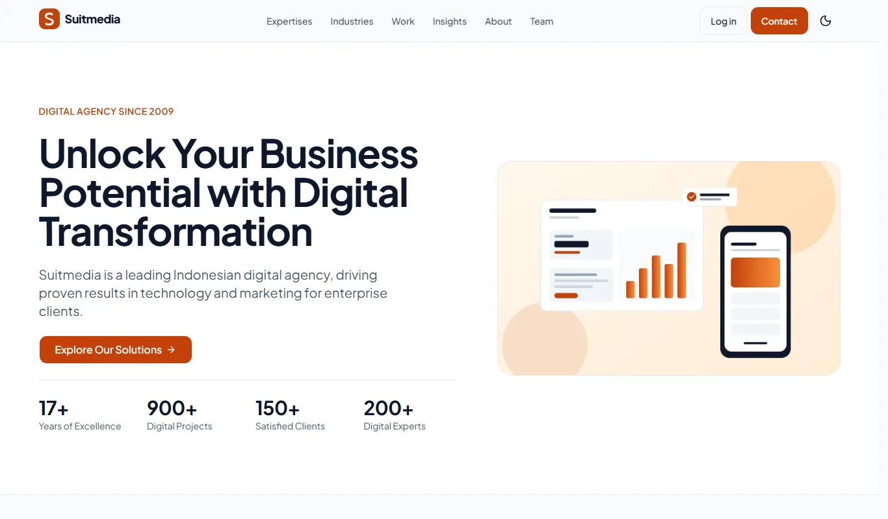
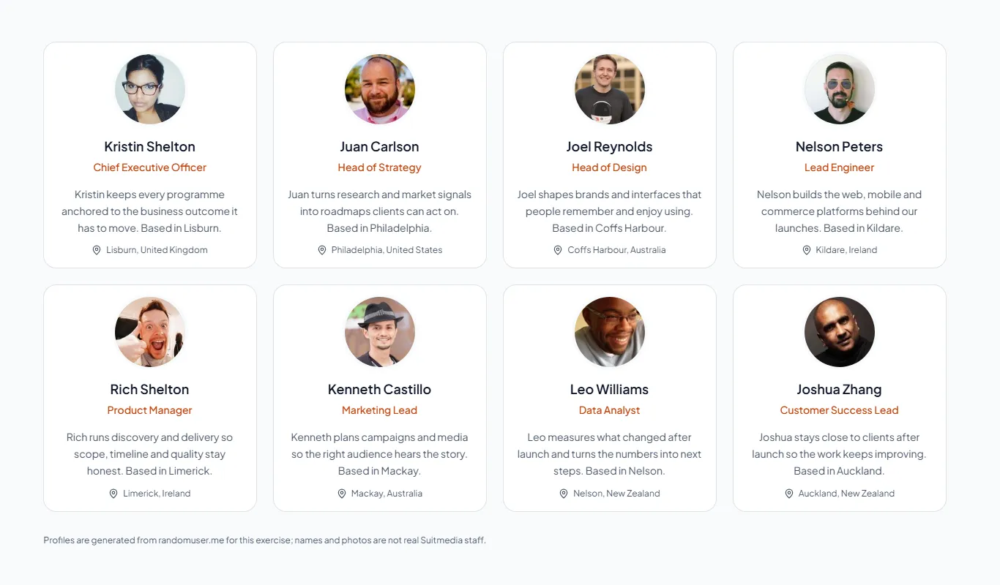

# Suitmedia Company Profile — Redesign

Rancang ulang situs company profile [suitmedia.com](https://suitmedia.com): beranda, layanan, industri, studi kasus, tim, kontak, dan blog dengan halaman tulis artikel yang dilindungi login. Dibangun dengan React, TypeScript, dan Tailwind CSS; konten blog dan pesan kontak dikelola melalui Backendless, dan setiap halaman diprarender saat build. Dikerjakan sebagai tugas Purwadhika Code Challenge 2; proyek pembelajaran yang tidak berafiliasi dengan Suitmedia.

**Demo:** <https://suitmedia-profile.vercel.app>


| Beranda | Halaman tim |
|---|---|
|  |  |

## Fitur

- **Blog berbasis Markdown.** Artikel ditulis di editor dengan tab tulis/pratinjau, tag, dan slug otomatis; draf tersimpan di browser hingga diterbitkan. Daftar artikel dapat disaring per tag dan dimuat bertahap.
- **Autentikasi.** Halaman tulis artikel hanya untuk pengguna yang masuk; pengunjung anonim diarahkan ke halaman login dan dikembalikan ke halaman semula setelah berhasil masuk. Sesi divalidasi ke Backendless setiap kali halaman dimuat.
- **Konten perusahaan yang lengkap.** Empat pilar layanan dengan enam belas jasa beserta model harga dan testimoni, delapan belas industri, dua belas studi kasus, serta halaman tim yang mengambil profil dari randomuser.me.
- **Formulir kontak** dengan validasi dan penyimpanan pesan ke Backendless.
- **Tema terang dan gelap** dengan aksen oranye khas Suitmedia; seluruh pasangan warna teks memenuhi WCAG AA.
- **Cepat dan mudah diakses.** Setiap halaman diprarender saat build, termasuk artikel yang sudah terbit; JavaScript dimuat setelah konten utama tergambar dan font di-host sendiri. Skor Lighthouse 99–100 di mobile dan 100 di desktop untuk Performance, Accessibility, Best Practices, dan SEO pada seluruh halaman.

## Teknologi

React 19 · TypeScript · Vite 8 · Tailwind CSS 4 · shadcn/ui · react-router 8 · react-hook-form + zod · react-markdown · Backendless REST API · Vercel

## Menjalankan secara lokal

```powershell
npm install
Copy-Item .env.example .env.local   # isi VITE_BACKENDLESS_API_URL
npm run dev
```

Halaman statis berjalan tanpa Backendless; blog, login, dan formulir kontak membutuhkan `VITE_BACKENDLESS_API_URL`. Perintah lain: `npm run build` (build produksi beserta prarender), `npm run preview` (menyajikan hasil build di `localhost:4173`), `npm run lint`, `npm run lint:a11y`, dan `npm run typecheck`.

## Dokumentasi

Penjelasan arsitektur, sumber data setiap halaman, pengaturan Backendless, akun peninjau, keamanan, skor Lighthouse, dan langkah deploy ada di [docs/panduan-teknis.md](docs/panduan-teknis.md).

## Penulis

**Nabila Mutiara Sani** — Full-Stack Web Developer, Malang, Indonesia
[GitHub](https://github.com/tiaraasani) · [LinkedIn](https://www.linkedin.com/in/tiaraasani) · nabila.mutiarasani@gmail.com
